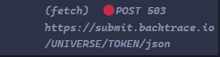

# Testes de Pagina Web de Testes: Saucedemo.com

Este projeto realiza a automação de testes de uma aplicação Web, cobrindo o fluxo completo de login, logout, seleção de produtos, fluxo de compra, navegação, carrinho e descoberta de erros e bugs. O ambiente utiliza Navegador (Chrome).

## Cenários de Teste

1.**Login de Usuários**
 - Realizar login de varios Usuários diferentes usando nome e senha validas e validar o resultado.

 - Tentar realizar login com conta bloqueada e validar o resultado.

**Resultado:** 
 - A maioria dos testes login funcionou.
    
 - A conta standard_user entrou, inclusive nos testes do Cypress, porem, no Cypress tem um bug de confirmação de autorização.

#

<div align="center">
    
</div>
<div align="center">
    
 </div>

 #

 - A conta locked_out_user esta bloqueada, inclusive nos testes do Cypress.
#

<div align="center">
    
</div>

#

 - A conta problem_user entrou porem as imagens e preços estão errados, inclusive nos testes do Cypress, mas, no Cypress tem um bug de confirmação de autorização.
#
<div align="center">
    
</div>

<div align="center">
    
</div>

#
 - A conta performance_out_user entrou sem problemas, mas esta com problemas de performance, demora de 3 a 7 segundos para abrir, inclusive nos testes do Cypress,  mas, no Cypress tem um bug de confirmação de autorização.
#
<div align="center">
    
</div>

#

 - A conta error_user entrou sem problemas, inclusive nos testes do Cypress, mas, no Cypress tem um bug de confirmação de autorização.
#
<div align="center">
    
</div>

#

 - A conta visual_user entrou, mas tem uma imagem bugada em um produto, inclusive nos testes do Cypress, mas no Cypress tem um bug de confirmação de autorização.
#
<div align="center">
    
</div>
  
#

2.**Logout de Usuários**
 - Realizar o logout de varios Usuários diferentes e validar o resultado.

**Resultado:** 
 - Todos os teste logout funcionaram bem, inclusive nos testes pelo Cypress.

 - A conta standard_user saiu corretamente, inclusive nos testes do Cypress.

#
<div align="center">
    
</div>
#

 - A conta locked_out_user esta bloqueada, inclusive nos testes do Cypress.

#
<div align="center">
    
</div>

#

 - A conta problem_user saiu corretamente, porem as imagens e preços estão errados, inclusive nos testes do Cypress.
#
<div align="center">
    
</div>

#

 - A conta performance_out_user saiu sem problemas, mas esta com problemas de performance, demora de 3 a 7 segundos para abrir, inclusive nos testes do Cypress.
#
<div align="center">
    
</div>
#

 - A conta error_user saiu corretamente, inclusive nos testes do Cypress.
#
<div align="center">
    
</div>

#

 - A conta visual_error saiu de forma correta, inclusive nos testes do Cypress.
#
<div align="center">
     
</div>

#

3.**Carrinho de compras**
 - Adicionar os produtos no carrinho e validar o resultado.
 - Remover item do carrinho e validar o resultado.
 - Remover todos os itens do carrinho de uma vez e validar o resultado.
#
**Resultado:** 
 - A maioria das contas passaram pelos testes sem problemas.

 - A conta standard_user adicionou e removel todos os produtos de forma rapida e sem erros, inclusive nos testes do Cypress.
#
 <div align="center">
    
 </div>

#

 - A conta locked_out_user esta bloqueada, inclusive nos testes do Cypress.
#
 <div align="center">
    
 </div>

#

 - A conta problem_user adicionou e removel todos os produtos de forma rapida e sem erros, inclusive nos testesd do Cypress.
#
<div align="center">
    
</div>

#

 - A conta performance_out_user adicionou e removel todos os produtos mas a performance esta ruim, chega demora 5 segundos para excluir um produto. 
#
<div align="center">
    
</div>

#

 - A conta error_user teve problemas para adicionar e remover varios produtos, inclusive nos testes do Cypress.
#
<div align="center">
    
</div>

#

 - A conta visual_error adicionou e removel os produtos corretamente, mas os produtos estão com fotos, preços e descrições errados.
#
<div align="center">
    
</div>

#

4.**Navegação da Pagina**

#
 - Realizar navegação entre paginas usando a função Name (Z to A) da pagina e validar o resultado.

 - Realizar navegação entre paginas usando a função Name (A to Z) da pagina e validar o resultado.

 - Realizar navegação entre paginas usando a função Preço (high to low) da pagina e validar o resultado.

 - Realizar navegação entre paginas usando a função Preço (low to high) da pagina e validar o resultado.

 - Realizar navegação entre paginas abrindo a pagina do produto pelo navegador e validando o resultado.

 - Realizar navegação entre paginas abrindo a pagina do produto e validando o resultado.

 - Realizar navegação entre paginas abrindo e fechando a pagina do produto e validando o resultado.

 - Realizar navegação entre paginas abrindo a sidebar Menu e validando o resultado.

 - Realizar navegação entre paginas entrando na pagina Sauce Labs e validando o resultado. **BUG** encontrado, porem dificil de reproduzi-lo 100% das vezes, resolvido com função **Cypress.on('uncaught:exception', () => { return false })**.

 - Realizar navegação entre paginas entrando na pagina Twiter  ( X ) e validando o resultado. **BUG** encontrado, porem dificil de reproduzi-lo 100% das vezes, resolvido com função **Cypress.on('uncaught:exception', () => { return false })**.

 - Realizar navegação entre paginas entrando na pagina Facebook e validando o resultado. **BUG** encontrado, porem dificil de reproduzi-lo 100% das vezes, resolvido com função **Cypress.on('uncaught:exception', () => { return false })**.

 - Realizar navegação entre paginas entrando na pagina Linkedin e validando o resultado. **BUG** encontrado, porem dificil de reproduzi-lo 100% das vezes, resolvido com função **Cypress.on('uncaught:exception', () => { return false })**.
-- **PS:Sempre quando tentado abrir outro site diferente dentro do Cypress ocorre esse BUG** --

 - Realizar navegação entre paginas entrando no carrinho e validando o resultado.

 - Realizar navegação entre paginas utilizando a função **Continuar Comprando** da pagina e validando o resultado.

 - Realizar navegação entre paginas entrando na função **Checout** e validando o resultado.

 - Realizar navegação entre paginas entrando na função **Finalizar compra** e validando o resultado.

#

 **Resultado:**
 - A maioria das contas tiveram problemas.

- A conta standard_user navegou sem nenhum problema, apenas um bug de autorização de carregamento no Cypress, mas resolvido, todas as paginas abriram , no navegador sem nenhum problema.
#
<div align="center">
    
</div>

<div align="center">
    
</div>

<div align="center">
    
</div>

<div align="center">
    
</div>

<div align="center">
    
</div>

<div align="center">
    
</div>

#

- A conta locked_out_user esta bloqueada, inclusive nos testes do Cypress.
#
<div align="center">
    
</div>

#

 - A conta problem_user esta com problemas para abrir outras paginas, adicionar produtos no carrinho, buscar produtos pelo id, produtos com imagens e descrições erradas.
#
<div align="center">
    
</div>

<div align="center">
    
</div>

<div align="center">
    
</div>

#

- A conta performance_glich_user navegou de forma muito demorada chegando a passar de 2 minutos no Cypress.
#
<div align="center">
    
</div>

#

- A conta error_user esta com problemas para adicionar produtos no carrinho, funções de busca por Nome e preço não  estão funcionando, preços mudados, funções mudando de lugar, inclusive nos testes do Cypress, mas tem outros bugs no Cypress como paginas não abrirem ou abrirem bugadas e erro de autorização.
#
<div align="center">
    
</div>

<div align="center">
    
</div>

<div align="center">
    
</div>

<div align="center">
    
</div>

#

 - A conta visual_user teve uma boa navegação mas algumas as imagens estão bugadas, produtos com nomes, preços e descrições erradas, inclusive nos testes do Cypress.
#
<div align="center">
    
</div>

<div align="center">
    
</div>

<div align="center">
    
</div>

#

4.**Pesquisar produtos da Pagina**
 - Pesquisar produtos com sucesso.

 - Pesquisar produtos pelo url usando o id com *comando customizado* e validando o resultado.

 - Pesquisar produtos pelo nome com *comando customizado* e validando o resultado.

 - Pesquisar produtos pelo url usando o *fixture* e validando o resultado.

 - Pesquisar produtos usando a posição com o comando Cypress *eq*.

#

## **Resultado:**
 - A maioria das contas foram bem.

 - A conta standard_user pesquisou todos os produtos de forma completa, mostrando o produto, sua descrição e preço correto, inclusive no Cypress.

#

<div align="center">
    
</div>

<div align="center">
    
</div>

<div align="center">
    
</div>

<div align="center">
    
</div>

#

- A conta locked_out_user esta bloqueada, inclusive nos testes do Cypress.
#
<div align="center">
    
</div>

#

- A conta problem_user esta com problema para buscar os produtos id, pois ao abrir certos produtos são diferentes dos que estavam em outras contas, inclusive nos testes do Cypress.
#
<div align="center">
    
</div>

<div align="center">
    
</div>

<div align="center">
    
</div>

#

 - A conta performance_glich_user buscou todos os produtos mas esta com problemas de performance, chegando a demorar mais de 1 minuto, tanto no navegador quanto no Cypress.
#
<div align="center">
    
</div>

#

- A conta error_user não teve problemas em pesquisar os produtos, pelo id, por click e nem os testes no Cypress usando comandos customizados de busca pelo nome, id, fixture, posição(eq).
#
<div align="center">
    
</div>

#

- A conta visual_user não teve problemas em buscar os protudos, nem abri-los usando id, nome, preço e seleção dos produtos, o problema são as imagens e preços dos produtos trocados, inclusive do Cypress.
#

<div align="center">
    
</div>

<div align="center">
    
</div>

#

5.**Floxo de compra da Pagina**
 - Realizar um fluxo de compra de ponta a ponta.

#

## **Resultado:**
 - A maioria das contas realizaram o teset completo.

 - A conta standard_user buscou os produtos, adicionou, realisou o checkout e concluiu a compra sem nenhum problem, de forma dinamica, rapida e completa, inclusive nos testes do Cypress.
#
<div align="center">
    
</div>

<div align="center">
    
</div>

#

- A conta locked_out_user esta bloqueada, inclusive nos testes do Cypress.
#
<div align="center">
    
</div>

#

- A conta problem_user falhou no teste devido a não ser possivel colocar os dados do checkout devido a um bug que impede de adicionar informação, inpedindo o pedido, inclusive nos testes do cypress.
#
<div align="center">
    
</div>

<div align="center">
    
</div>

<div align="center">
    
</div>

#

 - A conta performance_glich_user realisou todos os testes, desde as escolhas dos produtas ao finalização da compra, o problema é sua performance que demorou de 07 a 12 segundos para concluir o teste, inclusive nos testes do Cypress.
#
<div align="center">
    
</div>

<div align="center">
    
</div>

#

 - A conta error_user falhou no teste devido a um bug que impede de ser possivel adicionar alguns produtos no carrinho para fazer o pedido, inpedindo do usuário realizar a compra, inclusive nos testes do Cypress.
#
<div align="center">
    
</div>

<div align="center">
    
</div>

#

- A conta visual_user realisou todos os testes, desde as escolhas dos produtas ao finalização da compra, o problema são os produtos estarem com preços errados e as imagens trocadas, inclusive nos testes do Cypress.
#
<div align="center">
    
</div>

#

## Bugs e Erros

6.**Erros e Bugs da Pagina**
 - Deve demonstrar erro de autenticação de usuário com conta invalida e validar o resultado. **Erro**

 - Deve demonstrar erro de imagem na conta problem_user e validar o resultado. **Erro**

 - Deve demonstrar bug de performance no sistema na conta performance_glitch_user e validar o resultado. **BUG**

 - Deve demonstrar bug de adicionar itens ao carrinho na conta problem_user e validar o resultado. **BUG**

 - Deve demonstrar bug de checkout na conta problem_user e validar o resultado. **BUG**

 - Deve demonstrar bug de Request - TOKEN e validar o resultado. **BUG**

#

## **Resultado:**
 - Esta lina de testes foi feita co  o Cypress para validar esses erros pontuais do Cypress.

 - O teste de entrar com uma conta não criada de ocorre a mensaguem de conta não existe e abre o bug de autenticação no Cypress.
#

<div align="center">
    
</div>

#

 - O bug de entrar com a conta problem_user varias imagens bugadas, com valores que errados de até $V-1 por tras, em diferentes areas da pagina, e quando clica para comprar a tela fica branca e o site trava, inclusive nos testes do Cypress.

 #
   
<div align="center">
    
</div>

<div align="center">
    
</div>

<div align="center">
    
</div>

#

 - O bug performance, ao entrar com a conta preformance_glitch_user todos os processos e abrir, adicionar, buscar, abrir outros sites ficam extrememente lentos, inclusive no Cypress.
#
<div align="center">
       
</div>

#

 - O bug do carrinho, ao tentar adicionar no usuário problem_user onde alguns produtos no carrinho ou tentar remover ocorre um bug, em que os produtos não são adicionados e no caso da conta problem_user a alguns produtos bugados que travam o site.
#
<div align="center">
    
</div>

<div width="1920" align="center">
    
</div>

#

- O bug do Checkout, ao tentar adicionar as informações para fazer a compra, a área de adicionar o sobrenome buga, mudando o primeiro nome colocado e inpedindo a compra dos produtos.
#
<div width="1920" align="center">
    
</div>

<div width="560" align="center">
    
</div>

<div align="center">
    
</div>

#

 - O bug do Request e esclusiva do Cypress pois é um erro de mensagem, ao carregar a pagina no Cypress, não encontra a credencial valida do usuário (TOKEN) deixando uma mensagem infinita de equisiçõ de token, onde enchem o terminal de erros seguidos, plocurando credencial do usuário.

#
  <div align="center">
      
</div>


# Automação de Testes da Pagina Web de Testes: Saucedemo.com

<br>

Este projeto realiza a automação de testes de uma aplicação Web, cobrindo o fluxo completo de login, logout, seleção de produtos, fluxo de compra, navegação, carrinho e descoberta de erros e bugs. O ambiente utiliza Navegador (Chrome), Node.js, Cypress.io, Jenkins, Visual Studios e DevTools.

## Pré-requisitos

Certifique-se de que você possui as seguintes ferramentas instaladas:

 - **Node.js** (versão LTS recomendada)
 - **Visual Studios** (Ultima versão recomendada)
   
<br>

## Instalação

1. **Instalação**

```bash
   npm install
   npm install cypress
```
<br>

2. **Execução de testes**

```bash
   npx cypress open
```
<br>

## Melhoria: Automação de CI/CD

Realizando a integração do projeto ao GitHub, podemos Automatizar o código a integração Contínua (CI) e a Integração Contínua Deployment (CD), podendo ter melhor controle do versionamento do código.

<br>

## Pré-requisitos

Certifique-se de que você possui as seguintes ferramentas instaladas:

  - **Navegador** (Ultima versão recomendada)
  - **Jenkins** (Ultima versão recomendada)
  - **Node.js** (versão LTS recomendada)
  - **Visual Studios** (Ultima versão recomendada)

## 1. **Instalação**

- Abrir o visual Studios e digitar no terminal.
```bash
   npm install
   npm install cypress
```
<br>

## 2. **Ambiente configurado**


 - Instalar o Jenkins.

 - Criar uma porta host. (ex: 8090)

 - Abrir o navegador.

 - Entrar no localhost criado. (ex: localhost:8090 no navegador)

 - Ir no diretório de instalação do seu Jenkins e abrir o arquivo .txt com nome jenkins.err .

 - Digitar o usuario do arquivo .txt na pagina de login do Jenkins ou criar conta nova.

 - Clicar em Nova tarefa, escolher um nome e escolher a opção Pipeline.

 - Clicar em configurar, descer até Pipenile e escolher a opção Pipeline script.

 - Digitar no Script:

<br>

```bash
pipeline {
    agent any

    stages {
        stage('Clonando git e instalando dependencias') {
            steps {
                git branch: 'main', url: 'https://github.com/IsmaelGabrielDev/test-ui-swaglabs.git'
                bat 'npm install'
            }
        }
        stage('Testando aplicação') {
            steps {
                bat '''set NO_COLOR=1
npm run cy:run'''
            }
        }
    }
}
```
#

- Ou escolher a opcão Pipeline script from SCM, clicar na opção SCM e colocar Git.

- Copiar o link deste repositório e colar na opção URL que ira aparecer.
    
- Click em salvar, depois em Construir Agora.

- Clicando em Build você acompanha seu teste em execusão.

 <br>

## **Tecnologias Utilizadas**
  
 - **Cypress.io:** Framework para automação de testes.
 - **Nodejs:** Ferramenta de desenvolvimento web e hardware.
 - **Jenkins:** Ferramenta para automação de código aberto.
 - **GitHub:** Ferramenta de desenvolvimento colaborativo.
 - **Visual Studios** Ferramenta de desenvolvimento de software.
